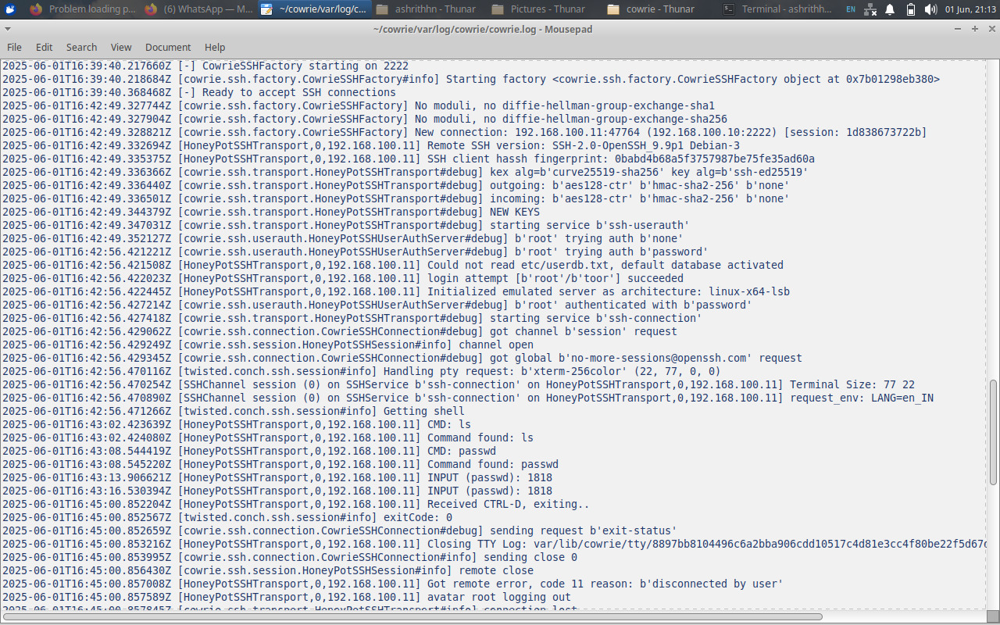
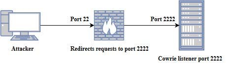
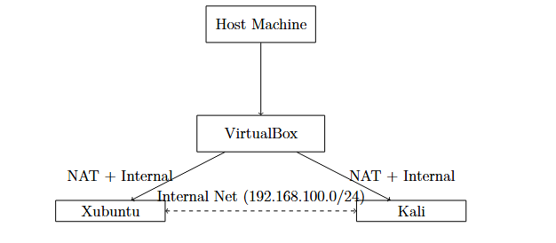

# Cybersecurity Deception System

**Academic project — deception-based honeypot lab using Cowrie, Grafana, Loki, Snort and VirtualBox.**

This repository contains a ready-to-upload, GitHub-friendly version of the project:
configuration examples, setup scripts, sample results and screenshots. The PDFs and
full reports were used as references but are not included in this repo. All sensitive
or system-specific values are intentionally left as examples (`*.example`) to avoid leaks.

---

## Repository layout

```
docs/          → diagrams and short textual summaries (ready to review)
screenshots/   → dashboard and log screenshots used in the report
config/        → example config files (rename & fill before use)
scripts/       → install/start/utility scripts (review before running)
results/       → sample logs, brief analysis and output examples
```

---

## Quick start (what to do before uploading to GitHub)

1. Inspect `config/*.example` files. Rename to remove `.example` only when you are ready
   to share credentials or real configuration (don't commit secrets).
2. Edit `scripts/*.sh` to match your system paths (they are documented and safe).
3. Add any large binaries, VM images or PDFs to a private storage (they should not be
   pushed to a public GitHub repo).
4. Run the scripts locally to test — see `How to run` below.

---

## How to run (lab overview)

This project was executed in a virtual lab using VirtualBox. The main workflow:

1. Prepare two VMs in VirtualBox:
   - Xubuntu (victim / honeypot) — static IP `192.168.100.10`
   - Kali Linux (attacker) — static IP `192.168.100.11`
   - Both use Adapter1 = NAT (internet), Adapter2 = Internal Network `intnet`

2. Configure Cowrie on Xubuntu and point its log output to a local directory.

3. Start Loki & Grafana (or the provided monitoring stack) and add Loki as a datasource in Grafana.

4. Start Cowrie and generate sample attacker activity from Kali:
   - `nmap -A 192.168.100.10`
   - `hydra -l root -P /path/to/wordlist ssh://192.168.100.10`

5. Visualize logs in Grafana Explore or dashboards (see screenshots in `screenshots/`).

---

## What is included

- `config/*.example` — Cowrie, Loki and Snort example configs (safe placeholders).
- `scripts/` — small bash/python helpers to install and start services (use as templates).
- `docs/project-summary.md` — one-page summary of the project.
- `results/` — sanitized sample logs and short threat analysis.
- `screenshots/` — images captured from your lab (Grafana, Cowrie logs, diagrams).

---

## Images (preview)

Below are the images included in the `screenshots/` folder — they will render on GitHub.






.jpeg)

.jpeg)

---

## Notes & safety

- **Do not** run any script without reading it — these are templates.
- Remove `.example` suffix only after ensuring no secrets remain.
- Avoid uploading VM images, ISOs or logs with real IPs to public repos.
- This repo is intended for academic demonstration and reproducibility, not production.

---

## Contact / Contributors

Project team: Ashrith H N (4HG22CS007), M S Anusha (4HG22CS023), Sindushree A (4HG22CS041)
Guide: Mr. Vinay A, Dept of CSE

